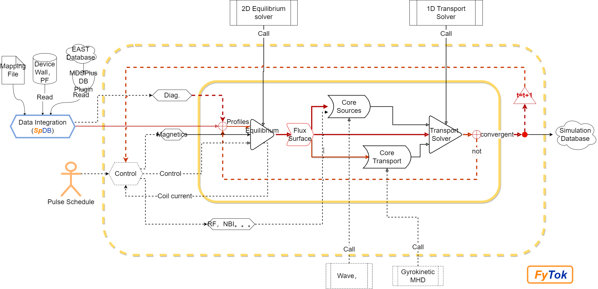

# FyTok Tutorial

## 描述

FyTok 是在FuYun架构下，针对托卡马克构建的集成建模和分析工具。其数据组织基于 IMAS 数据字典的托卡马克本体描述。

## FyTok 功能 

- 以模拟器的形式进行托卡马克建模和分析。

## 主要内容
本文档是 **FyTok** 的使用教程（攥写中。。。）。

- 快速上手 (Quick Start):  

- 详细教程 (Tutorial):
    

